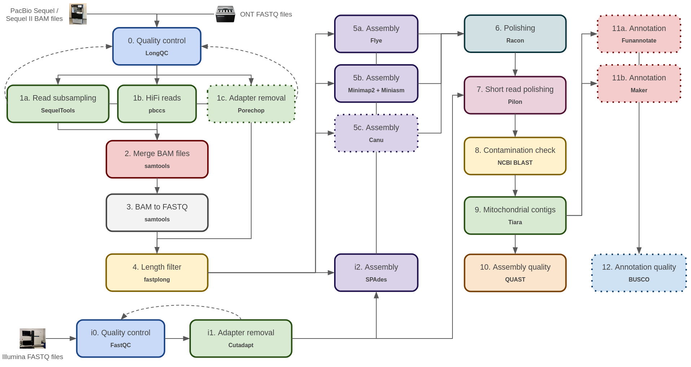

# Genome Assembly and Annotation Workflow 🧬🍄🦠


> [!CAUTION]
> 🧬 **IMPORTANT NOTE FOR ODIE (CIALE) SERVER USERS**
> 
> ⚠️ **Warning:** The `main` branch is **not compatible** with the Odie server (CIALE, Salamanca).
>
> **If you are working on Odie, do not use this branch** -> 
> please switch to the dedicated legacy branch:
> 👉 [**Go to legacy/odie_ciale branch**](https://github.com/SergioAlias/ga-workflow/tree/legacy/odie_ciale)
>
> ```bash
> # To switch your local environment:
> git checkout legacy/odie_ciale
> ```

This repository provides a modular, bash-based workflow for genome assembly and annotation using PacBio, ONT and/or Illumina reads.



Modules with dotted lines are not implemented yet.

## Before you start

This is an **_ad hoc_ pipeline** developed for a specific server environment. That means:
- Some programs are expected to be pre-installed system-wide (e.g., available in `/usr/bin` or similar).
- Some tools come from user-managed Conda environments (see below).
- Others may require manual installation (e.g., in `$HOME/bin`).

You **must check and update the paths for all required software in `config.sh`** and ensure the programs are available as expected, specially if you are using this workflow in a different server.

For programs that require a Conda environment, I highly recommend installing [Miniconda](https://docs.anaconda.com/free/miniconda/index.html) and then installing [Mamba](https://anaconda.org/conda-forge/mamba) for a lightweight and fast experience. I provide YAML files under `/envs` to create all neccesary environments with `mamba env create -f <file.yml>`. Check module code and `config.sh` to know if you need a Conda environment for that one.

There is only one Conda environment for which I do not provide a YAML file: the one for module 11a (annotation with Funannotate). Since both Conda and Mamba fail to resolve this environment, I strongly recommend creating it manually with:

```bash
mamba create -n funannotate "python>=3.6,<3.9" funannotate
```

Also, if you want to use GeneMark-ES/ET within Funannotate, please note that a license key is now required. If you are affiliated with an academic or non-profit institution, or a U.S. government agency, you can obtain it for free. You will need to manually download both the program and the license key from http://topaz.gatech.edu/GeneMark/license_download.cgi. After downloading, extract the `gmes_linux_64_4.tar.gz` file to your desired location and follow the instructions provided in the `INSTALL` text file. Here's a brief summary:

```bash
gunzip gm_key_64.gz
cp gm_key_64 ~/.gm_key
perl change_path_in_perl_scripts.pl '/usr/bin/env perl'
```

## How to run the workflow

1. **Edit the configuration:** Open `config.sh` and set all relevant variables. Each module has its own parameters and some of them have activation flags (`*_ACTIVATE`). It is **very important** to set `config.sh` correctly so the pipeline sets input and output files for each module accordingly. For example, if you are not going to run module 1a, **it is not enough not to run it**: you **must** set `RSUB_ACTIVATE` to False. Otherwise, module 2 will try to use the non-existent output of module 1a as input. 

2. **Run a module:** Launch the desired module by specifying its number:

```bash
./daemon.sh N
```

Replace `N` with the module number you want to run (`0`, `1a`, `1b`, `1c`, `2`, `3`, `4`, `5a`, `5b`, `6`, `7`, `8`, `9a`, `9b`, `10`, `11b`, `i0`, `i1`, `i2`).

For modules **0** (LongQC) and **i0** (FastQC), you can use the optional `-r` flag:

```bash
./daemon.sh 0 -r
./daemon.sh i0 -r
```
The `-r` flag indicates that QC should be repeated after running module 1a/1b/1c (long reads) or i1 (short reads), to check the quality of processed reads. For other modules, the `-r` flag is ignored.

## Workflow Modules

Each module is run separately through the `daemon.sh` controller. Modules are:

- **0**: Quality Control with LongQC
- **1a**: Read Subsampling by Longest Subreads per CLR
- **1b**: Converting Subreads into CCS (HiFi Reads)
- **2**: Merging SMRT Cells
- **3**: Converting BAM Files into FASTQ
- **4**: Length Filtering with fastplong
- **5a**: Assembly with Flye
- **5b**: Assembly with Minimap2 and Miniasm
- **6**: Assembly Polishing with Racon
- **7**: Assembly Polishing with short reads with Pilon
- **8**: Contamination check with NCBI BLAST
- **9a**: Mitochondrial contigs detection
- **9b**: Plasmid contigs detection
- **10**: Assembly Quality with QUAST
- **11a**: (INCOMPLETE) Genome annonation (Fungi) with Funannotate
- **11b**: Genome annonation (Bacteria, plasmids) with Bakta
- **i0**: FastQC (Illumina)
- **i1**: Cutadapt (Illumina)
- **i2**: Assembly with SPAdes (Illumina, but long reads are also accepted for hybrid assembly)

Each module creates logs in your project directory under `/logs`.

For full details on parameters, see comments in `config.sh`. For a visual understanding of the workflow, see the picture above.

## Examples

```bash
# PacBio HiFi assembly from raw subreads (Fungi)
./daemon.sh 0         # Quality Control
./daemon.sh 1b        # Convert to CCS (HiFi) [OPTIONAL]
./daemon.sh 0 -r      # Repeat QC on processed reads
./daemon.sh 2         # Merge SMRT cells [OPTIONAL]
./daemon.sh 3         # Convert BAM to FASTQ
./daemon.sh 4         # Filter by length [OPTIONAL]
./daemon.sh 5a        # Assemble with Flye
./daemon.sh 6         # Polish assembly
./daemon.sh i0        # Quality control of short reads
./daemon.sh i1        # Adapter trimming [OPTIONAL]
./daemon.sh i0 -r     # Repeat QC on processed short reads
./daemon.sh 7         # Polish assembly with short reads
./daemon.sh 8         # Check contamination
./daemon.sh 9a        # Detect mitochondrial contigs
./daemon.sh 10        # Assess assembly quality


# Illumina and PacBio subread hybrid assembly (Fungi)
./daemon.sh i0        # Quality control of short reads
./daemon.sh i1        # Adapter trimming [OPTIONAL]
./daemon.sh i0 -r     # Repeat QC on processed short reads
./daemon.sh 0         # Quality Control
./daemon.sh 2         # Merge SMRT cells [OPTIONAL]
./daemon.sh 3         # Convert BAM to FASTQ
./daemon.sh 4         # Filter by length [OPTIONAL]
./daemon.sh i2        # Assemble with SPAdes
./daemon.sh 6         # Polish assembly
./daemon.sh 7         # Polish assembly with short reads
./daemon.sh 8         # Check contamination
./daemon.sh 9a        # Detect mitochondrial contigs
./daemon.sh 10        # Assess assembly quality


# ONT assembly without short reads (Fungi) (WARNING: modules 0 and 1c do not work for ONT yet)
./daemon.sh 0         # Quality Control
./daemon.sh 1c        # ONT Adapter trimming [OPTIONAL]
./daemon.sh 0 -r      # Repeat QC on processed reads
./daemon.sh 4         # Filter by length [OPTIONAL]
./daemon.sh 5a        # Assemble with Flye
./daemon.sh 6         # Polish assembly
./daemon.sh 8         # Check contamination
./daemon.sh 9a        # Detect mitochondrial contigs
./daemon.sh 10        # Assess assembly quality
```

## Contact

If you are struggling with something related to the workflow, feel free to [open an issue](https://github.com/SergioAlias/ga-workflow/issues/new) or contact me: **salias[at]ucm[dot]com**.
